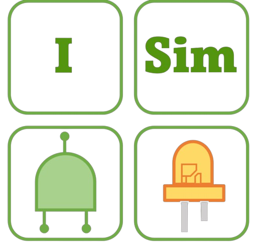

  <body>
    

      

        
      

      

        <h1>Welcome to I-Sim!</h1>
      

    

  </body>

Hi! In this responsety you can find the source code of our Schematic Simulator.
# Table of Contents

 - Doc-Schematic Editor (Note: Not finished)
	 - Main Structure (UML)
	 - Important Classe's
- Doc-Simulation View
# Doc-Schematic Editor
## Main Structure

## Important Classe's

Here is a list of all important classes and structures in this Program:

| File  | Type | Description | Variables | Functions |
| :---  |:----:|    :----:   | :----    | :----      |
| Component.cs | <blue>Interface</blue> | This enum is normally used to describe how an IC is constructed. Each component must have a reference to an item object, because it is used to display the component on the surface. | <ul><li><Lblue>item</Lblue> *[Item]* => reprersents the component on the display with a Caption.</li><li> <Lblue>objectData</Lblue> *[ObjectData]*<orange> => no describtion</orange> </li><li> <Lblue>pinsAnalog</Lblue> *[List<Pin<float\>>]* => List with all Pins, which only can transmitt or recive analog signals <Lblue>[float]</Lblue> </li><li> <Lblue>pinsTrisState</Lblue> *[List<Pin<int\>>]* => List with all Pins, which only can transmitt or recive Tri-State signals <Lblue>[int]</Lblue></li><li> <Lblue>pinsBool</Lblue> *[List<Pin<bool\>>]* => List with all Pins, which only can transmitt or recive High/Low signals <Lblue>[bool]</Lblue> </li></ul>|
| IOComponent.cs | <blue>Interface</blue> | This enum is normally used to describe how an Object that can change its representation during the simulation. Each IOComponent has inherit an **Component** because you have to implement for example Simulation functions.| <ul><li></li></ul>|

# License
You are not allowed to publisch or copy the content which is presented in this repositorie. You only be allowed to use it to develop extensions for my Program. Therefore you can download the Visual Studio 2022 Project for testing. 

**Important this Porject exist since the 20th of December 2023 this means that this project is not yet well developed and can therefore have even bigger issues. Therefore, I do not accept any liability for any damage caused to your computer by my program.**

*Copyright © 2024 BoTech-Computer All Rights Reserved*

  <body>
    

      

        
      

      

        <h6 style="text-align: center; ">Powered By:</h6>
        
      

    

  </body>
